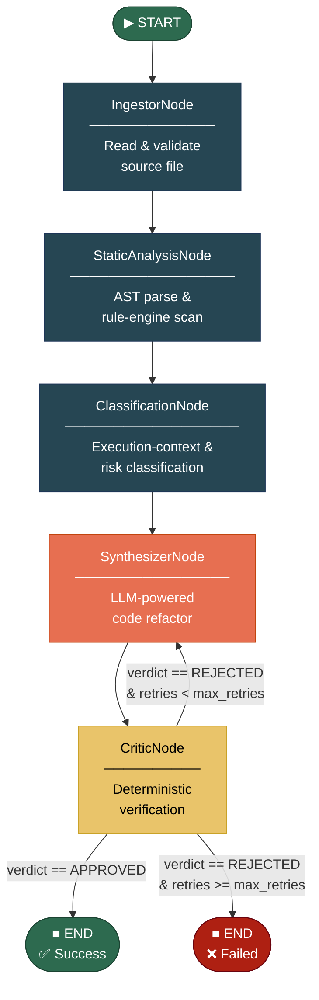
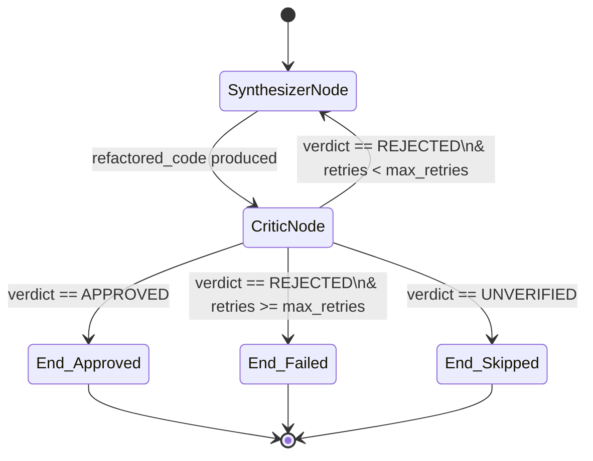

# ShadowGuard-Agent — Architecture Document

> **Version:** 1.0  
> **Last Updated:** 2026-09-18  
> **Status:** Approved  

---

## Table of Contents

1. [System Architecture Diagram](#1-system-architecture-diagram)
2. [State Schema Specification](#2-state-schema-specification)
3. [Node Specifications](#3-node-specifications)
4. [Failure Mode and Effects Analysis (FMEA)](#4-failure-mode-and-effects-analysis-fmea)
5. [Conditional Edge Logic](#5-conditional-edge-logic)

---

## 1. System Architecture Diagram

The ShadowGuard-Agent pipeline is modeled as a directed acyclic graph (DAG) with a single conditional back-edge. Each node performs one well-defined transformation on the shared pipeline state. The `CriticNode` introduces a conditional loop back to `SynthesizerNode` on rejection, with a hard cap of **2 retries** to guarantee termination.



> [!NOTE]
> Nodes colored in **dark teal** are fully deterministic. The **orange** node (`SynthesizerNode`) is the only generative (LLM-backed) node. The **yellow** node (`CriticNode`) is deterministic but acts as a gate for the generative output.

---

## 2. State Schema Specification

The pipeline state is a single, shared, mutable object threaded through every node. It is defined using both **Pydantic v2** models (for validation and serialization) and a **TypedDict** (for LangGraph compatibility).

### 2.1 Violation Model

```python
from pydantic import BaseModel, Field
from typing import Literal


class Violation(BaseModel):
    """Represents a single rule violation detected during static analysis."""

    rule_id: str = Field(
        ...,
        description="Unique identifier for the rule, e.g. 'SG-SEC-001'.",
        examples=["SG-SEC-001", "SG-PERF-012"],
    )
    rule_name: str = Field(
        ...,
        description="Human-readable name of the violated rule.",
        examples=["hardcoded-secret", "missing-csrf-token"],
    )
    severity: Literal["CRITICAL", "HIGH", "MEDIUM", "LOW", "INFO"] = Field(
        ...,
        description="Severity of the violation.",
    )
    line_number: int = Field(
        ...,
        ge=1,
        description="1-indexed line number where the violation occurs.",
    )
    column: int = Field(
        ...,
        ge=0,
        description="0-indexed column offset within the line.",
    )
    snippet: str = Field(
        ...,
        description="Source code snippet surrounding the violation site.",
    )
    message: str = Field(
        ...,
        description="Explanation of why this code is flagged.",
    )
    suggested_fix: str = Field(
        ...,
        description="Suggested remediation or refactored code fragment.",
    )
```

### 2.2 Pipeline State — Pydantic Model

```python
from pydantic import BaseModel, Field
from typing import Literal


class PipelineState(BaseModel):
    """Complete state object carried through the ShadowGuard-Agent pipeline."""

    # ── Ingestion ────────────────────────────────────────────────
    file_path: str = Field(
        ...,
        description="Absolute path to the analyzed file.",
    )
    raw_code: str = Field(
        ...,
        description="Original source code content read from disk.",
    )
    language: Literal["python", "typescript", "javascript"] = Field(
        ...,
        description="Programming language of the source file.",
    )

    # ── Classification ───────────────────────────────────────────
    execution_context: Literal["client", "server", "ambiguous"] = Field(
        default="ambiguous",
        description=(
            "Execution context determined by framework directive analysis. "
            "Defaults to 'ambiguous' when no explicit directive is found."
        ),
    )

    # ── Static Analysis ──────────────────────────────────────────
    ast_violations: list[Violation] = Field(
        default_factory=list,
        description="Accumulated list of rule violations from AST analysis.",
    )
    risk_level: Literal["CRITICAL", "HIGH", "MEDIUM", "LOW", "NONE"] = Field(
        default="NONE",
        description="Aggregate risk level derived from violations.",
    )
    risk_score: int = Field(
        default=0,
        ge=0,
        le=100,
        description="Numeric risk score (0 = no risk, 100 = maximum risk).",
    )

    # ── Synthesis ────────────────────────────────────────────────
    refactored_code: str | None = Field(
        default=None,
        description="LLM-generated refactored source code, if applicable.",
    )
    refactor_status: Literal["SUCCESS", "PARTIAL", "FAILED", "SKIPPED"] = Field(
        default="SKIPPED",
        description="Outcome of the refactoring attempt.",
    )

    # ── Critic ───────────────────────────────────────────────────
    critic_verdict: Literal["APPROVED", "REJECTED", "UNVERIFIED"] = Field(
        default="UNVERIFIED",
        description="CriticNode verdict on the refactored code.",
    )
    critic_reasoning: str = Field(
        default="",
        description="Free-text explanation of the critic's decision.",
    )

    # ── Retry Control ────────────────────────────────────────────
    synthesis_retries: int = Field(
        default=0,
        ge=0,
        description="Number of Synthesizer → Critic loop iterations completed.",
    )
    max_retries: int = Field(
        default=2,
        ge=0,
        description="Maximum allowed retries before the pipeline terminates with FAILED.",
    )
```

### 2.3 Pipeline State — TypedDict (LangGraph)

```python
from typing import Annotated, Literal, TypedDict
from operator import add


class Violation(TypedDict):
    rule_id: str
    rule_name: str
    severity: Literal["CRITICAL", "HIGH", "MEDIUM", "LOW", "INFO"]
    line_number: int
    column: int
    snippet: str
    message: str
    suggested_fix: str


class ShadowGuardState(TypedDict):
    file_path: str
    raw_code: str
    language: Literal["python", "typescript", "javascript"]
    execution_context: Literal["client", "server", "ambiguous"]
    ast_violations: Annotated[list[Violation], add]
    risk_level: Literal["CRITICAL", "HIGH", "MEDIUM", "LOW", "NONE"]
    risk_score: int
    refactored_code: str | None
    refactor_status: Literal["SUCCESS", "PARTIAL", "FAILED", "SKIPPED"]
    critic_verdict: Literal["APPROVED", "REJECTED", "UNVERIFIED"]
    critic_reasoning: str
    synthesis_retries: int
    max_retries: int
```

### 2.4 State Reducers

State reducers define how concurrent or sequential updates to the same field are merged.

| Field | Reducer | Behavior |
|---|---|---|
| `ast_violations` | **`add`** (append) | New violations returned by a node are **appended** to the existing list. This is an accumulator — violations are never removed, only added. This ensures the `CriticNode` can compare violation counts across iterations. |
| All other fields | **Last-write-wins** | The most recent value written by any node **replaces** the previous value. No merge logic is applied. This is the default LangGraph reducer. |

> [!IMPORTANT]
> The `add` reducer on `ast_violations` is critical to the Critic's **monotonic violation-count invariant**. If a refactored file introduces *more* violations than the original, the Critic detects this by comparing `len(ast_violations)` before and after synthesis, and rejects the refactor.

---

## 3. Node Specifications

### 3.1 IngestorNode

| Property | Details |
|---|---|
| **Purpose** | Read a source file from disk, validate its existence and encoding, and extract the programming language from its extension. |
| **Engine Type** | 🔵 **Deterministic** |
| **Input Fields Consumed** | `file_path` |
| **Output Fields Produced** | `raw_code`, `language` |
| **Error Handling** | If the file does not exist or cannot be decoded, the node raises a `FileIngestionError`. If `ast.parse()` (for Python) or the equivalent parser fails on syntactically invalid source, the file is flagged with `refactor_status='SKIPPED'` and an error detail is appended to `critic_reasoning`. The pipeline continues to `END` without further processing. |

**Processing Logic:**

1. Resolve `file_path` to an absolute, normalized path.
2. Verify the file exists and is readable.
3. Read the file content as UTF-8 into `raw_code`.
4. Determine `language` from the file extension (`.py` → `python`, `.ts` → `typescript`, `.js` → `javascript`).
5. Perform a preliminary syntax check (e.g., `ast.parse()` for Python) to ensure the file is parseable.

---

### 3.2 StaticAnalysisNode

| Property | Details |
|---|---|
| **Purpose** | Parse the source code into an AST, traverse it with the rule engine, and emit a list of `Violation` objects. |
| **Engine Type** | 🔵 **Deterministic** |
| **Input Fields Consumed** | `raw_code`, `language`, `file_path` |
| **Output Fields Produced** | `ast_violations` |
| **Error Handling** | AST parse failures are caught via `try/except`. On failure, the node emits zero violations and sets `refactor_status='SKIPPED'` with a diagnostic message. Individual rule execution errors are logged but do not halt the scan — a partial result is always returned. |

**Processing Logic:**

1. Select the appropriate parser backend based on `language`.
2. Parse `raw_code` into an Abstract Syntax Tree.
3. Load the active rule set (security, performance, style, framework-specific).
4. Walk the AST and evaluate each rule against every node.
5. For each match, construct a `Violation` object with precise location data.
6. Apply file-path exclusion globs (e.g., `**/test/**`, `**/__mocks__/**`) to suppress known false positives.
7. Return the accumulated violations via the `add` reducer.

---

### 3.3 ClassificationNode

| Property | Details |
|---|---|
| **Purpose** | Determine the execution context of the file (`client`, `server`, or `ambiguous`) and compute the aggregate `risk_level` and `risk_score`. |
| **Engine Type** | 🔵 **Deterministic** |
| **Input Fields Consumed** | `raw_code`, `language`, `ast_violations`, `file_path` |
| **Output Fields Produced** | `execution_context`, `risk_level`, `risk_score` |
| **Error Handling** | If no framework directives are found (e.g., `"use client"`, `"use server"` for React/Next.js), the node conservatively defaults to `execution_context='ambiguous'`. This triggers advisory-level warnings in downstream nodes rather than silently skipping checks. |

**Processing Logic:**

1. Scan the first N lines of `raw_code` for framework directives (`"use client"`, `"use server"`, etc.).
2. Inspect import statements and module patterns for server-only or client-only APIs.
3. Assign `execution_context` based on the strongest signal, defaulting to `ambiguous`.
4. Compute `risk_score` as a weighted sum of violation severities:
   - `CRITICAL` = 25 pts, `HIGH` = 15 pts, `MEDIUM` = 8 pts, `LOW` = 3 pts, `INFO` = 1 pt.
   - Score is clamped to `[0, 100]`.
5. Map `risk_score` to `risk_level`:
   - `0` → `NONE`, `1–20` → `LOW`, `21–50` → `MEDIUM`, `51–79` → `HIGH`, `80–100` → `CRITICAL`.

---

### 3.4 SynthesizerNode

| Property | Details |
|---|---|
| **Purpose** | Generate a refactored version of the source code that resolves the detected violations while preserving functional correctness. |
| **Engine Type** | 🟠 **Generative** (LLM-backed) |
| **Input Fields Consumed** | `raw_code`, `ast_violations`, `language`, `execution_context`, `risk_level`, `synthesis_retries`, `critic_reasoning` (on retry) |
| **Output Fields Produced** | `refactored_code`, `refactor_status`, `synthesis_retries` |
| **Error Handling** | If the LLM returns an empty or unparseable response, `refactor_status` is set to `PARTIAL` and the original `raw_code` is preserved in `refactored_code`. If `risk_level == 'NONE'` (no violations), the node short-circuits with `refactor_status='SKIPPED'` and `refactored_code=None`. On retry (when routed back from `CriticNode`), the node receives the `critic_reasoning` explaining the previous rejection and uses it to guide its next attempt. |

**Processing Logic:**

1. If `risk_level == 'NONE'`, short-circuit: set `refactor_status='SKIPPED'` and return.
2. Construct a structured prompt containing:
   - The original `raw_code`.
   - The full list of `ast_violations` with locations and suggested fixes.
   - The `execution_context` and `language` for context-aware refactoring.
   - On retry: the previous `critic_reasoning` for targeted correction.
3. Call the LLM with a constrained output format (fenced code block).
4. Parse and validate the LLM response.
5. Increment `synthesis_retries` by 1.
6. Set `refactor_status='SUCCESS'` (pending Critic verification).

---

### 3.5 CriticNode

| Property | Details |
|---|---|
| **Purpose** | Independently verify the refactored code by re-running deterministic static analysis and comparing violation counts against the original. |
| **Engine Type** | 🔵 **Deterministic** |
| **Input Fields Consumed** | `refactored_code`, `raw_code`, `ast_violations`, `language`, `synthesis_retries`, `max_retries` |
| **Output Fields Produced** | `critic_verdict`, `critic_reasoning`, `refactor_status` (on final failure) |
| **Error Handling** | If `refactored_code` is `None` or empty, the Critic sets `critic_verdict='UNVERIFIED'` and routes to `END`. If re-parsing the refactored code raises a syntax error, the verdict is `REJECTED` with a reasoning string identifying the parse failure. |

**Processing Logic:**

1. If `refactored_code` is `None`, set `critic_verdict='UNVERIFIED'` and proceed to `END`.
2. Parse `refactored_code` into an AST using the same parser as `StaticAnalysisNode`.
3. Re-run the full rule engine on the refactored AST.
4. Compare the new violation count against the original `ast_violations` count.
5. **Monotonic invariant check:** if new violations ≥ original violations, set `critic_verdict='REJECTED'`.
6. If all original violations are resolved and no new ones are introduced, set `critic_verdict='APPROVED'`.
7. Populate `critic_reasoning` with a detailed diff summary.
8. If rejected and `synthesis_retries >= max_retries`, set `refactor_status='FAILED'` to prevent further loops.

---

## 4. Failure Mode and Effects Analysis (FMEA)

The following table enumerates the known failure modes of the ShadowGuard-Agent pipeline, their severity, their potential risk to production systems, and the architectural safeguards in place to mitigate each.

| Failure Mode | Severity | Risk to Production | Architectural Safeguard / Mitigation |
|---|---|---|---|
| LLM synthesizes refactor that introduces new violations | **HIGH** | Deployed code contains new anti-patterns | CriticNode re-runs deterministic AST analysis on refactored code; rejects if violation count increases. The monotonic violation-count invariant guarantees that accepted refactors are strictly better than the original. |
| Secret pattern regex produces false positive on test fixtures | **MEDIUM** | Developer fatigue, ignored findings | Rule engine supports file-path exclusion globs (e.g., `**/test/**`, `**/__mocks__/**`). Exclusion patterns are configurable per-rule and per-project. |
| AST parsing fails on syntactically invalid source files | **LOW** | Pipeline crash, partial scan | IngestorNode wraps `ast.parse()` in `try/except`; files with parse errors are flagged as `SKIPPED` with error details in `critic_reasoning`. The pipeline gracefully continues to `END` without crashing. |
| Cyclic Synthesizer ↔ Critic loop exhausts token budget | **HIGH** | Runaway cloud costs, pipeline hang | Hard cap of `max_retries=2` enforced at the graph edge level. Additionally, a monotonic violation-count invariant prevents the Synthesizer from making "sideways" changes. A per-file token budget is enforced at the LLM call layer. |
| Framework directive misclassification (RSC vs client) | **MEDIUM** | False negatives on client-side violations | Conservative default: files without explicit directives are classified as `ambiguous`, triggering advisory warnings for both client-side and server-side rule sets. This errs on the side of over-reporting rather than missing real issues. |

> [!WARNING]
> The **Cyclic Synthesizer ↔ Critic loop** failure mode is the highest systemic risk. Without the `max_retries` hard cap, a pathologically adversarial input could cause unbounded LLM invocations. Always ensure `max_retries` is set to a finite value (default: `2`).

---

## 5. Conditional Edge Logic

The `CriticNode` is the only node in the pipeline with conditional outgoing edges. All other edges are unconditional and linear. The routing logic is evaluated **after** every `CriticNode` execution.

### 5.1 Decision Function

```python
from typing import Literal


def route_after_critic(state: ShadowGuardState) -> Literal["synthesizer", "end"]:
    """Determine the next node after CriticNode evaluation.

    Returns:
        "synthesizer" to retry refactoring, or "end" to terminate the pipeline.
    """
    if state["critic_verdict"] == "APPROVED":
        # ✅ Refactored code passed all checks — pipeline complete.
        return "end"

    if state["critic_verdict"] == "REJECTED":
        if state["synthesis_retries"] < state["max_retries"]:
            # 🔄 Retry: route back to SynthesizerNode with critic feedback.
            return "synthesizer"
        else:
            # ❌ Retries exhausted: terminate with FAILED status.
            # refactor_status is set to 'FAILED' by CriticNode before this point.
            return "end"

    # UNVERIFIED — no refactored code was produced (e.g., risk_level was NONE).
    return "end"
```

### 5.2 Routing Table

| Condition | `critic_verdict` | `synthesis_retries` vs `max_retries` | Next Node | Terminal State |
|---|---|---|---|---|
| Refactor passes verification | `APPROVED` | *N/A* | **END** | `refactor_status='SUCCESS'` |
| Refactor rejected, retries remain | `REJECTED` | `retries < max_retries` | **SynthesizerNode** | *(pipeline continues)* |
| Refactor rejected, retries exhausted | `REJECTED` | `retries >= max_retries` | **END** | `refactor_status='FAILED'` |
| No refactored code produced | `UNVERIFIED` | *N/A* | **END** | `refactor_status='SKIPPED'` |

### 5.3 Loop Invariants

The following invariants are maintained across all iterations of the Synthesizer ↔ Critic loop:

1. **Termination guarantee:** `synthesis_retries` is monotonically increasing and bounded by `max_retries` (default `2`). The loop executes at most `max_retries + 1` times (1 initial attempt + 2 retries).

2. **Violation-count monotonicity:** The Critic only approves a refactor if the violation count is **strictly less than** the original. This prevents infinite "sideways" edits that neither improve nor worsen the code.

3. **Feedback propagation:** On each rejection, `critic_reasoning` is populated with an actionable explanation that the Synthesizer consumes on the next iteration, enabling targeted correction rather than blind retry.



---

> NOTE FOR YOU GUYS
> For local development and testing, set `max_retries=0` to disable the retry loop entirely. This runs each file through a single Synthesizer → Critic pass, which is faster and consumes fewer LLM tokens during iterative development.

---

*End of Architecture Document.*
